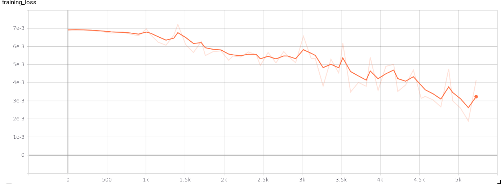

# The cats vs dogs classification using CNN


## Problem description

In this problem we are trying to build an algorithm that ought to classify: cats and dogs. This kind of classification is easier unto humankind, now, we are to build a computer based algorithm to mimic this idea.

### Installation
+ Clone this repo:
```bash
git clone https://github.com/jp-ishimwe/cat_vs_dog.git
cd cat_vs_dog
```
### Dataset

+ Download our preprocessed data [here](https://drive.google.com/file/d/1EKlJzyB_ocUcX0J5_K7YW5D4NBKLn0dD/view?usp=sharing)
+ Extract the unzipped file to Cat_Dog_data

### Run the main file

```bash
python main.py
```

## The model performance and structure
### The model structure


### Training and testing errors


